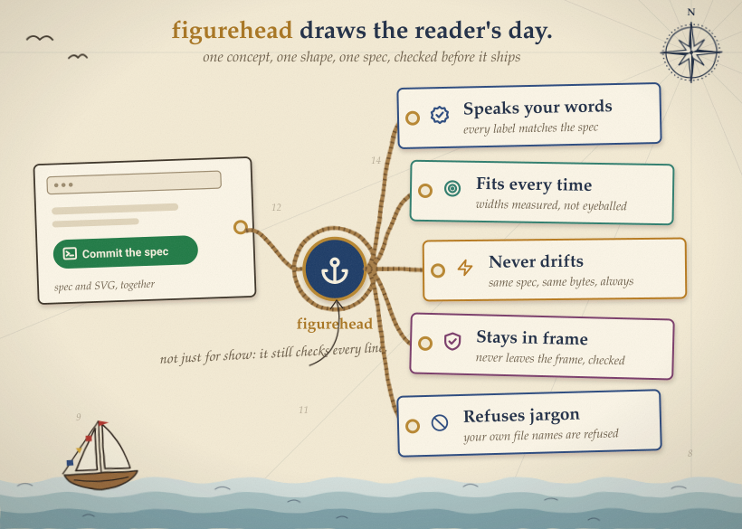

<h1 align="center">⚓ figurehead</h1>

  <b>Draws a README's hero from a committed spec, checked before it ships.</b>

  
  
  

Works with 
  

## Features

figurehead draws the hero graphic at the top of a README, from a spec you commit beside it.

🖼️ <b>One real picture</b> A concept statement first, then a shape and a style: the hero draws the reader's day, not a diagram.

✅ <b>Checked before it ships</b> Every label in the spec has to appear in the picture, fit its card, and stay inside the frame.

🔁 <b>Never drifts</b> Same spec, same bytes: every committed example rebuilds byte for byte, so a stale hero fails the build.

🗣️ <b>Speaks your words</b> A label that matches your own file, function or export name is refused by name.

🔒 <b>Nothing leaves your machine</b> The renderer reads only the spec you hand it: no network call, no telemetry.

## How it compares

| | [oficiallyAkshay/figurehead](https://github.com/oficiallyAkshay/figurehead) | [kyechan99/capsule-render](https://github.com/kyechan99/capsule-render) | [wei/socialify](https://github.com/wei/socialify) | [eli64s/readme-ai](https://github.com/eli64s/readme-ai) |
| --- | --- | --- | --- | --- |
| Committed spec | ✅ | ❌ | ❌ | ❌ |
| Byte-for-byte check | ✅ | ❌ | ❌ | ❌ |
| Runs offline | ✅ | ❌ | ❌ | ❌ |
| Installation | Skill | None | None | pip |
| Model | Your agent | None | None | Optional |

## Security and limits

No credential. The concept statement is written by your own agent; render and check are pure code and call no model.

- ❌ reads your code. `check --repo` opens local file, folder and export names only, to catch a label that matches one, and only when that flag is passed
- ❌ sends a file anywhere
- ❌ updates itself
- ❌ sends telemetry

By default, the `register/reader-nouns` check runs only with `--repo`; without it, that one check is skipped. It needs Node 20 or newer and nothing else.
